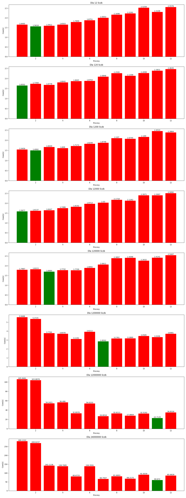

# Multiprocessing w pythonie dla wyszukania liczb pierwszych

## Cel analizy
Analiza ma na celu sprawdzenie jak podział na procesy ma wpływ na szybkość wykonywania poszczególnych programu, w tym wypadku na szukania liczb pierwszych.

## Metoda
Program wyszukuje liczby pierwsze w przedziale od 0 do liczb podanych w poniższej lini
``` python
lenght = [cpus * n for n in [1, 10, 100, 1000, 10000, 100000, 1000000, 2000000]] 
```
Maksymalna wartość która sprawdzałem to przedział od 0 do 2.000.000 * liczba wątków w moim PC, czyli 12 <sup>Intel(R) Core(TM) i5-10400F CPU @ 2.90GHz 2.90 GHz</sup>	

Podział na procesy wygląda następująco, a wszystko tworzy mi ta pętla
```python
starts_steps = [[x, cpu] for x in range(cpu)]
```
dzięki temu program tworzy mi liste która zawiera w sobie podlisty z [liczba od której zaczyna pętla, wielkość przeskoku w pętli]. Dla przykładu, biorąc przedział liczb od 0 do 24 dla 4 procesów, starts_steps powinien wyglądać nastepująco:
```python
[[0, 4], [1, 4], [2, 4], [3, 4]]
```
Następnie wszystko jest wrzucane do funkcji szukających liczb pierwszych
```python
def find_prime_numbers(start, end, step):
    for i in range(start, end, step):
        if i > 1:
            for j in range(2, int(i**0.5) + 1):
                if i % j == 0:
                    break
```
Po uruchomieniu 4procesów, liczenie powinnno wyglądać mniej więcej tak:
```python
proces 1 - for i in range(0, 24, 4)
proces 2 - for i in range(1, 24, 4)
proces 3 - for i in range(2, 24, 4)
proces 4 - for i in range(3, 24, 4)
```
dzięki temu każdy procesor musi wykonać podobną liczbe obliczeń. Inaczej by było gdybym chciał to zrobić z takim podziałem:
```python
proces 1 - for i in range(0, 6, 1)
proces 2 - for i in range(6, 12, 4)
proces 3 - for i in range(12, 18, 4)
proces 4 - for i in range(18, 24, 4)
```
Wtedy proces 4 musiałby wykonać najwięcej obliczeń, gdyż działa na większych liczbach co powoduje większą ilość pętl

## Rezultat


## Wniosek
Jak widać na załączonym wyżej obrazku. Multiprocessing nabiera większego sensu wtedy kiedy ilość obliczeń się zwiększa. Jako, że znalezienie liczb pierwszych w przedziale od 0 do 24 nie jest w ogóle wyzwaniem dla komputera, sam podział listy na poszczególne procesy i ich uruchomionie zabiera więcej czasu niż znalezienie jednemu wątku liczb pierwszych. Różnice zaczyna się widać dopiero po 1,2mln liczbach do sprawdzenia. Wtedy poraz pierwszy uruchomienie więcej niż trzech procesów nabiera sensu.